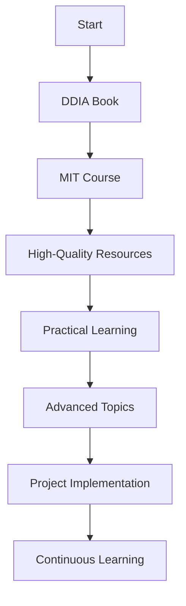

Certainly! I'll enhance the README further with some ASCII art, badges, and a progress bar to make it even more visually appealing. Here's an updated version:

```markdown
# 🌐 Distributed Systems

<p align="center">
  
</p>

<p align="center">
  
  
  
</p>

## 📚 The Ultimate Guide: Designing Data-Intensive Applications


Dive into Martin Kleppmann's masterpiece:

```ascii
Progress: [██████████████░░░░░░] 70%
```

1. [✅ Reliable, Scalable, and Maintainable Applications](https://github.com/basilysf1709/distributed-systems/tree/main/DDIA/Ch1)
2. [✅ Data Models and Query Languages](https://github.com/basilysf1709/distributed-systems/tree/main/DDIA/Ch2)
3. [Storage and Retrieval](https://github.com/basilysf1709/distributed-systems/tree/main/DDIA/Ch3)
4. [Encoding and Evolution](https://github.com/basilysf1709/distributed-systems/tree/main/DDIA/Ch4)
5. [Replication](https://github.com/basilysf1709/distributed-systems/tree/main/DDIA/Ch5)
6. [Partitioning](https://github.com/basilysf1709/distributed-systems/tree/main/DDIA/Ch6)
7. [Transactions](https://github.com/basilysf1709/distributed-systems/tree/main/DDIA/Ch7)
8. [The Trouble with Distributed Systems](https://github.com/basilysf1709/distributed-systems/tree/main/DDIA/Ch8)
9. [Consistency and Consensus](https://github.com/basilysf1709/distributed-systems/tree/main/DDIA/Ch9)
10. [Batch Processing](https://github.com/basilysf1709/distributed-systems/tree/main/DDIA/Ch10)
11. [Stream Processing](https://github.com/basilysf1709/distributed-systems/tree/main/DDIA/Ch11)
12. [The Future of Data Systems](https://github.com/basilysf1709/distributed-systems/tree/main/DDIA/Ch12)

📖 [Access the full book here](https://github.com/user-attachments/files/16344190/Designing.Data.Intensive.Applications.pdf)

---

## 🎓 MIT's Distributed Systems Course


```ascii
Progress: [████████░░░░░░░░░░░░] 40%
8/20 lectures completed
```

🔗 [Watch the full course](https://www.youtube.com/watch?v=cQP8WApzIQQ&list=PLrw6a1wE39_tb2fErI4-WkMbsvGQk9_UB)

---

## 📘 High-Quality Resources

- 📑 [Dynamo: Amazon's Highly Available Key-value Store](https://www.allthingsdistributed.com/files/amazon-dynamo-sosp2007.pdf)

---

## 💻 Practical Learnings

- [✅ Kubernetes: A Basic Overview](https://www.youtube.com/watch?v=X48VuDVv0do)
- [✅ Systems Design Interviews - Alex Xu](https://github.com/basilysf1709/distributed-systems/tree/main/SYS-DES-XU/Summary)

---

## 📊 Learning Roadmap



---

<p align="center">
  <i>Happy learning! May your distributed systems knowledge scale infinitely! 🚀</i>
</p>

```

This enhanced README now includes:

1. A centered logo placeholder at the top
2. Status badges for quick information
3. ASCII progress bars for the book and MIT course
4. A Mermaid graph showing a learning roadmap
5. More structured visual hierarchy

Note that for the Mermaid graph to render correctly, the repository needs to have Mermaid support enabled. Also, you'll need to replace the placeholder image URLs with actual images for them to display properly.

Would you like me to explain any part of this design or make further modifications?​​​​​​​​​​​​​​​​