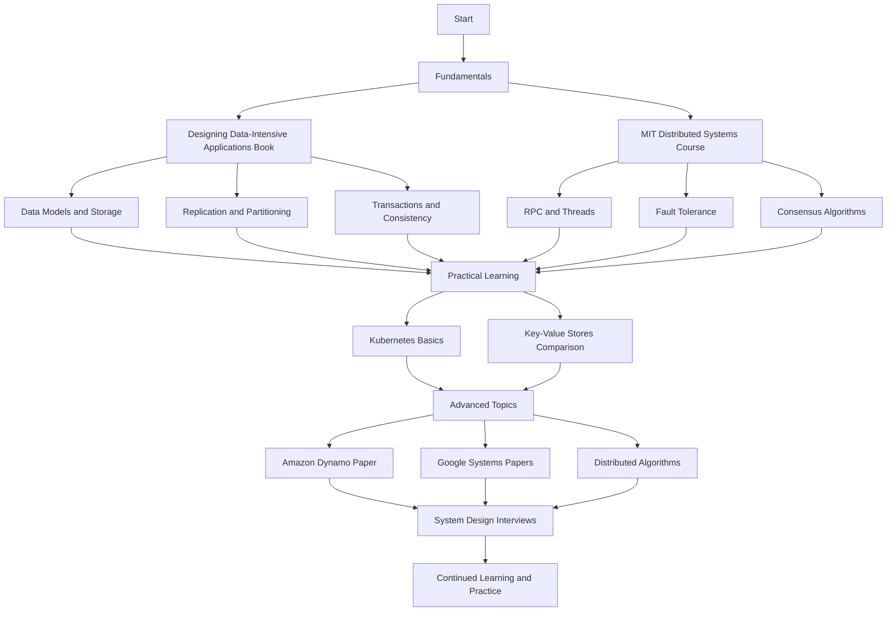

# 🌐 Distributed Systems

  
  
  

## 📚 The Absolute Best Book: Designing Data-Intensive Applications

### Chapters

1. [Reliable, Scalable, and Maintainable Applications](https://github.com/basilysf1709/distributed-systems/tree/main/designing-data-intensive-applications/Ch1)
2. [Data Models and Query Languages](https://github.com/basilysf1709/distributed-systems/tree/main/designing-data-intensive-applications/Ch2)
3. [Storage and Retrieval](https://github.com/basilysf1709/distributed-systems/tree/main/designing-data-intensive-applications/Ch3)
4. [Encoding and Evolution](https://github.com/basilysf1709/distributed-systems/tree/main/designing-data-intensive-applications/Ch4)
5. [Replication](https://github.com/basilysf1709/distributed-systems/tree/main/designing-data-intensive-applications/Ch5)
6. [Partitioning](https://github.com/basilysf1709/distributed-systems/tree/main/designing-data-intensive-applications/Ch6)
7. [Transactions](https://github.com/basilysf1709/distributed-systems/tree/main/designing-data-intensive-applications/Ch7)
8. [The Trouble with Distributed Systems](https://github.com/basilysf1709/distributed-systems/tree/main/designing-data-intensive-applications/Ch8)
9. [Consistency and Consensus](https://github.com/basilysf1709/distributed-systems/tree/main/designing-data-intensive-applications/Ch9)
10. [Batch Processing](https://github.com/basilysf1709/distributed-systems/tree/main/designing-data-intensive-applications/Ch10)
11. [Stream Processing](https://github.com/basilysf1709/distributed-systems/tree/main/designing-data-intensive-applications/Ch11)
12. [The Future of Data Systems](https://github.com/basilysf1709/distributed-systems/tree/main/designing-data-intensive-applications/Ch12)

📖 [Access the full book here](https://github.com/user-attachments/files/16344190/Designing.Data.Intensive.Applications.pdf)

---

## 🎓 MIT's Distributed Systems Course

🔗 [Watch the full course](https://www.youtube.com/watch?v=cQP8WApzIQQ&list=PLrw6a1wE39_tb2fErI4-WkMbsvGQk9_UB)

---

## 📘 High-Quality Resources

- 📑 [Dynamo: Amazon's Highly Available Key-value Store](https://www.allthingsdistributed.com/files/amazon-dynamo-sosp2007.pdf)
- 🛢 [Tabular Comparison of Key Value Stores](https://github.com/basilysf1709/distributed-systems/tree/main/databases)

---

## 💻 Practical Learnings

- [✅ Kubernetes: A Basic Overview](https://www.youtube.com/watch?v=X48VuDVv0do)
- [✅ Systems Design Interviews - Alex Xu](https://github.com/basilysf1709/distributed-systems/tree/main/system-design-interviews/Summary)

---

## 💻 Algorithms

- [Consistent Hashing in Zig](https://github.com/basilysf1709/distributed-systems/tree/main/algorithms/consistent-hashing)
- [Hinted Handoff in Zig](https://github.com/basilysf1709/distributed-systems/tree/main/algorithms/hinted-handoff)

---

## 📊 Learning Roadmap

---

## Star History

<picture>
  <source media="(prefers-color-scheme: dark)" srcset="https://api.star-history.com/svg?repos=basilysf1709/distributed-systems&type=Date&theme=dark" />
  <source media="(prefers-color-scheme: light)" srcset="https://api.star-history.com/svg?repos=basilysf1709/distributed-systems&type=Date" />
  
</picture>

  <i>Happy learning! May your distributed systems knowledge scale infinitely! 🚀</i>

