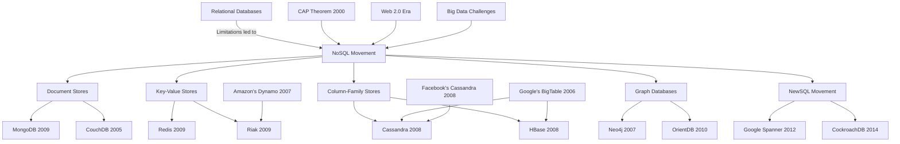

# Tabular comparison of key value stores

## Table

| Database | Type | Replication Technique | Consistency Protocol | Node Discovery | Partitioning |
|----------|------|----------------------|----------------------|----------------|--------------|
| [MongoDB](https://www.mongodb.com/docs/manual/core/architecture-concepts) | Document store | Single-leader | Consensus (Raft) | Config Servers | Range-based and Hash-based |
| [Redis](https://redis.io/topics/architecture) | Key-value store | Single-leader | Eventual Consistency | Sentinel | Hash slots |
| [Cassandra](https://cassandra.apache.org/doc/latest/architecture/overview.html) | Wide-column store | Leaderless | Quorum | Gossip Protocol | Hash-based |
| [DynamoDB](https://docs.aws.amazon.com/amazondynamodb/latest/developerguide/HowItWorks.html) | Key-value & Document | Leaderless | Eventual Consistency (also offers strong consistency) | Proprietary | Consistent Hashing |
| [Couchbase](https://docs.couchbase.com/server/current/learn/architecture-overview.html) | Document store | Leaderless | MVCC | Gossip Protocol | Hash-based |
| [Neo4j](https://neo4j.com/docs/operations-manual/current/architecture/) | Graph database | Causal Clustering | Raft | Core Discovery | Graph partitioning |
| [Cosmos DB](https://learn.microsoft.com/en-us/azure/cosmos-db/distribute-data-globally) | Multi-model | Leaderless (and others) | Tunable Consistency | Proprietary | Hash-based |
| [HBase](https://hbase.apache.org/book.html#architecture) | Wide-column store | Single-leader | Consensus (ZooKeeper) | ZooKeeper | Range-based |
| [Cloud Firestore](https://firebase.google.com/docs/firestore/data-model) | Document store | Multi-region | Strong Consistency | Proprietary | Automatic |
| [CouchDB](https://docs.couchdb.org/en/stable/intro/overview.html) | Document store | Leaderless | MVCC | Cluster-aware | Hash-based |
| [ScyllaDB](https://docs.scylladb.com/stable/architecture/) | Wide-column store | Primary-backup | Tunable Consistency | Gossip Protocol | Consistent Hashing |
| [Riak](https://docs.riak.com/riak/kv/latest/learn/concepts/index.html) | Key-value store | Leaderless | Vector Clocks | Gossip Protocol | Consistent Hashing |

---

## History

